# **Traffic Sign Recognition** 

---

**Build a Traffic Sign Recognition Project**

The goals / steps of this project are the following:
* Load the data set
* Explore, summarize and visualize the data set
* Design, train and test a model architecture
* Use the model to make predictions on new images
* Analyze the softmax probabilities of the new images

## Rubric Points
### Here I will consider the [rubric points](https://review.udacity.com/#!/rubrics/481/view) individually and describe how I addressed each point in my implementation.  

---
### Writeup / README

#### 1. Provide a Writeup / README that includes all the rubric points and how you addressed each one. You can submit your writeup as markdown or pdf. You can use this template as a guide for writing the report. The submission includes the project code.

This markdown document is the project writeup.

### Data Set Summary & Exploration

#### 1. Provide a basic summary of the data set. In the code, the analysis should be done using python, numpy and/or pandas methods rather than hardcoding results manually.

I used the the Python standard library to calculate summary statistics of the traffic
signs data set:

* The size of training set is 34799
* The size of the validation set is 4410
* The size of test set is 12630
* The shape of a traffic sign image is (32, 32)
* The number of unique classes/labels in the data set is 43

#### 2. Include an exploratory visualization of the dataset.

Displayed below are some example images pulled from the data set. As can be seen there is a wide variety of sign images being supplied to the model; signs well lit in daylight, signs well light at night, signs poorly lit at night, signs that are too pixelated to make a determination as to its type without the supplied label, etc.

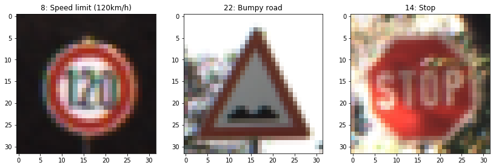
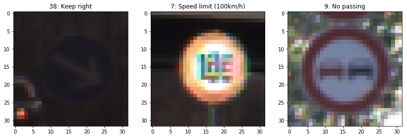
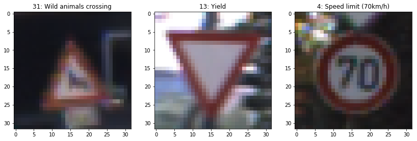

In addition to viewing a subset of the images, I determined the quantity of each sign type that is provided for each example set (training, validation and testing). The bar charts below show that there is not an even distribution of sign type examples with a rather large discrepancy between the type with the most examples and the type with the least (~2100 to ~175). This means that the model will train to the different sign types disproportionately.

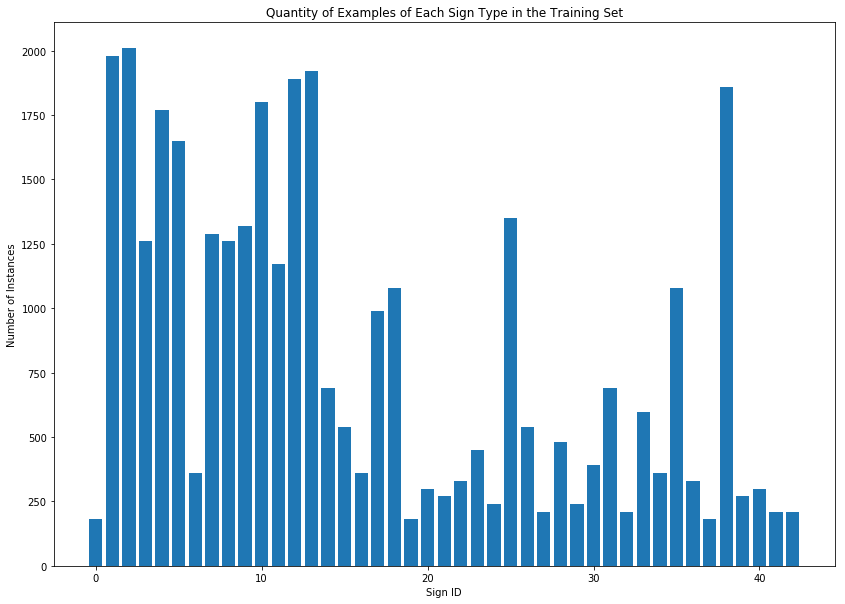
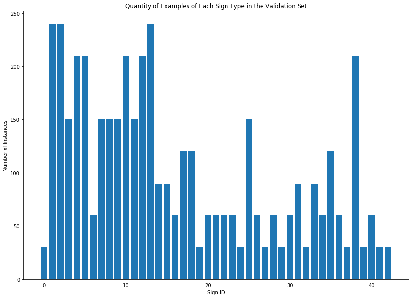
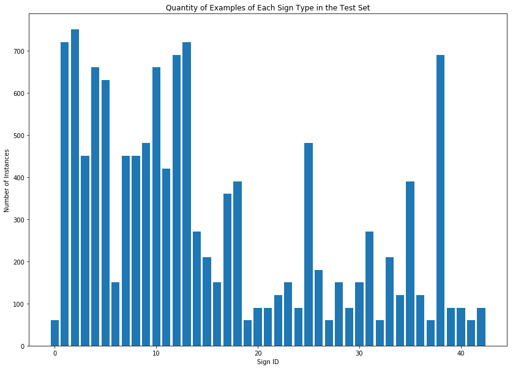

### Design and Test a Model Architecture

#### 1. Describe how you preprocessed the image data. What techniques were chosen and why did you choose these techniques? Consider including images showing the output of each preprocessing technique. Pre-processing refers to techniques such as converting to grayscale, normalization, etc. (OPTIONAL: As described in the "Stand Out Suggestions" part of the rubric, if you generated additional data for training, describe why you decided to generate additional data, how you generated the data, and provide example images of the additional data. Then describe the characteristics of the augmented training set like number of images in the set, number of images for each class, etc.)

The first preprocessing step that I take on the images is to allow the set to be extended with translated, rotated and scaled images (I only perform this action on the training set as I want to increase the number of images that the model uses for tuning but not alter the validation or test sets). Each of the alterations are done on a small scale so as to not affect the quality of the images. For translation I moved the images at random, 1 to 2 pixels horizontally and vertically. For rotation I randomly rotated the images between [-15, 15] degrees with selections made at 5 degree increments. For scaling, I scaled the image to either 0.9 or 1.1 of the original size with the selection being made randomly. Below I show examples of the images translated (row 1), rotated (row 2) and scaled (row 3). The new data set will therefore be four times the size of the original data (139196 images).

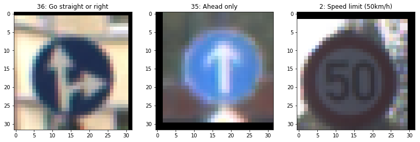
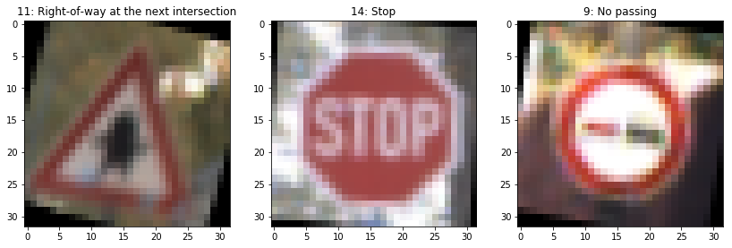
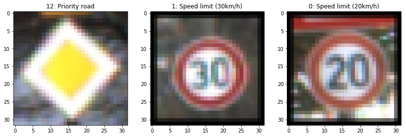

After extending the data set (a step unique to the training set), I created a grayscale version of all of the images and then normalized the grayscale images. An example of some of the images that were produced in this step is displayed below. As can be seen, the contrast between light and dark is accentuated with the grayscale image allowing greater distinction between the marking in the middle of the sign and the surrounding solid color including in lower light situations.

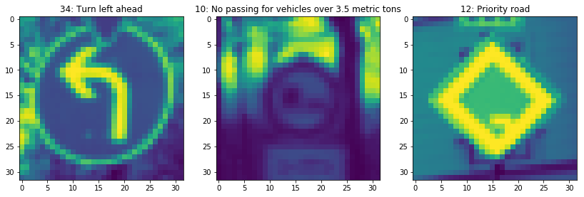

After I converted the images to grayscale, I decided to also add HSV versions of the image to the image set. I convert and normalize HSV versions of all of the images. As can be seen by the example images below this gives the model an additional set of information that it can learn from that won't be provided by the grayscale or RGB versions of the images.

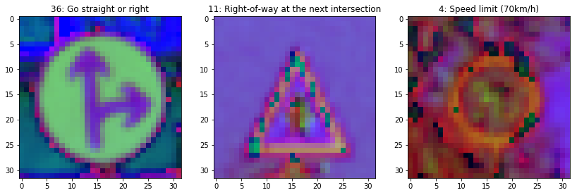

After I've created grayscale and HSV versions of the image set I normalize the RGB image set. Now all of the image sets are normalized which will aid the model's ability to train to the data. 

If I tried to concatenate all of the datasets at this point it wouldnt't work with the model as each set has a different depth (three for RBg and HSV and one for grayscale). Also the model would be trying to tune to all of the different image types and therefore wouldn't be able to tune to any of them well. Instead of simply concatenating the image set, I concatenate the three versions of each individual image into a single element which changes the initial depth from 3 to 7.

An opportunity for further exploration would be to try the model I developed on each image set individually rather than giving the model access to all of the datasets. This way it can be determined whether the collection of the image types (RGB, grayscale and HSV) really does give improved performance over the individual data sets.

#### 2. Describe what your final model architecture looks like including model type, layers, layer sizes, connectivity, etc.) Consider including a diagram and/or table describing the final model.

Initially I tried to come up with my own architecture which included a 5x5 convolution layer and an inception layer but upon implementation it was producing a validation of ~4% and didn't change after any of the training iterations.

After trying to come up with my own implementation, I tried the implementation from the [article](http://yann.lecun.com/exdb/publis/pdf/sermanet-ijcnn-11.pdf) that was linked in the ipython notebook template. I again encountered extremely low and unchanging validation accuracy in the single digits.

After not having much luck with the two above implementations I decided to go with the proven LeNet architecture and just alter the sizes between layers (upon reflection the problem I was encountering above was likely from excessive overfitting of the model). The final adaptation of the LeNet architecture that I used is presented in the table below.

| Layer         		|     Description	        					| 
|:---------------------:|:---------------------------------------------:| 
| Input         		| 32x32x7 (RGB, Grayscale, HSV) image   		| 
| __Layer 1:__         	|    							                | 
| Convolution 5x5     	| 1x1 stride, valid padding, outputs 28x28x20 	|
| Activation			| RELU											|
| Max pooling	      	| 2x2 stride,  outputs 14x14x20 				|
| __Layer 2:__         	|    							                | 
| Convolution 5x5     	| 1x1 stride, valid padding, outputs 10x10x42 	|
| Activation			| RELU											|
| Max pooling	      	| 2x2 stride,  outputs  5x5x42   				|
| __Flatten:__         	| outputs 1050       			                | 
| __Layer 3:__         	|    							                | 
| Fully Connected     	| outputs 500 	                                |
| Activation			| RELU											|
| __Layer 3:__         	|    							                | 
| Fully Connected     	| outputs 120 	                                |
| Activation			| RELU											|
| __Layer 3:__         	|    							                | 
| Fully Connected     	| outputs 43 	                                |
| Activation			| RELU											|
 
#### 3. Describe how you trained your model. The discussion can include the type of optimizer, the batch size, number of epochs and any hyperparameters such as learning rate.

To train the model, I used the Adam Optimizer with a learning rate of 0.001. After I settled on the model structure that I was going to use, I set the batch size to be 50 as I found that it improves performance over a larger batch size of around 120.

I used 10 epochs for the training iterations. I found that with 10 I could see them validation accuracy plateau and the effects after it plateaus. It does not significantly decrease (or increase after its initial decrease) after it reaches its maximum value and so I expect early termination would produce approximately the same result.

Opportunities for further exploration would be to try different optimizers, different learning rates, different batch sizes and early termination of the training. Different optimizers could be used to see whether the Adam Optimizer really is giving improved performance. For instance a gradient optimizer could be tested. A variable training rate could be used to try to increase performance as it begins to plateau. A decaying exponential would be ideal for this purpose. Experimentation could be done with the batch sizes testing for instance sizes of 20 to 120 in increments of 5. Lastly early termination can be used to reduce the overfitting that is likely occuring by continuing to train the model after it's first decrease in validation accuracy.

#### 4. Describe the approach taken for finding a solution and getting the validation set accuracy to be at least 0.93. Include in the discussion the results on the training, validation and test sets and where in the code these were calculated. Your approach may have been an iterative process, in which case, outline the steps you took to get to the final solution and why you chose those steps. Perhaps your solution involved an already well known implementation or architecture. In this case, discuss why you think the architecture is suitable for the current problem.

My final model results were:
* training set accuracy of 99.5%
* validation set accuracy of 95.4%
* test set accuracy of 94.5%

My first attempt was to create my own architecture for the CNN. The first layer was a 5x5 convolution with a sigmoid activation function and a max pooling step. Next I tried to use an inception layer with 3x3 convolution, 1x1 convolution, 5x5 convolution and an average pooling components. The idea was to utilize as much information in the single layer as possible. The concatenation of the components went through a sigmoid activation function followed by a max pooling step. After my inception layer I tried a 5x5 convolution step with a sigmoid activation function the proceeded to flaten my structure. After it was flattened I used 3 fully connected layers, each using a sigmoid activation function to reduce the outputs to 43. 

This model resulted in an unchanging validation accuracy of ~4% epoch to epoch. This was likely the result of having too many parameters and causing excessive overfitting. Due to my lack of success I thought I would try an architecture that has already proven itself to achieve a decent starting accuracy that I could then improve upon.

My next architecture was taken from the [article](http://yann.lecun.com/exdb/publis/pdf/sermanet-ijcnn-11.pdf) that was linked in the ipython notebook template. The article presented multiple sizings for the layer structure that they laid out and the one I decided to try was the one where the first convolutional layer outputs a depth of 38 and the second convolutional layer outputs a depth of 64. 

Unfortunately the validation accuracy for this model was also sitting around 5%. This model has significantly fewer parameters than the previous architecture attempt and so overfitting should not have been as much of an issue as it was there (though the first attempt may have been excessively overfit and thus this architecture, while having many fewer parameters, may also be overfitting). Also I was not using the exact input structure that the article used which would also likely contribute to my poor results. With the lack of success of the previous two architecture attempts (the one I came up with and one from the provided literature), I decided to use the LeNet architecture as it can produce validation accuracies up to 88% without modification from the lab earlier in the course.

I did not alter the LeNet layer structure in my final model, just the outputs of each layer. I increased these outputs as I'm training to more information than the LeNet architecture began with (I have an input depth of 7 for each image instead of starting with an input depth of 1). This produced much better validation accuracies than my previous attempts with different architectures, reaching levels to meet the rubric requirement.

In addition to evaluating the accuracy of the model on the validation set, I calculated the precision and recall of the model for the validation set for each sign type. The results of these calculations are depicted in the figures below.

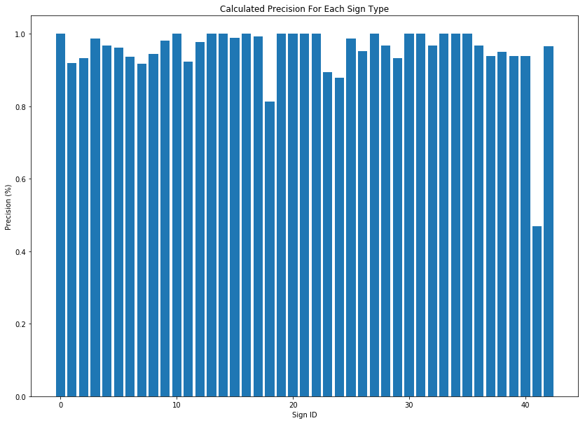
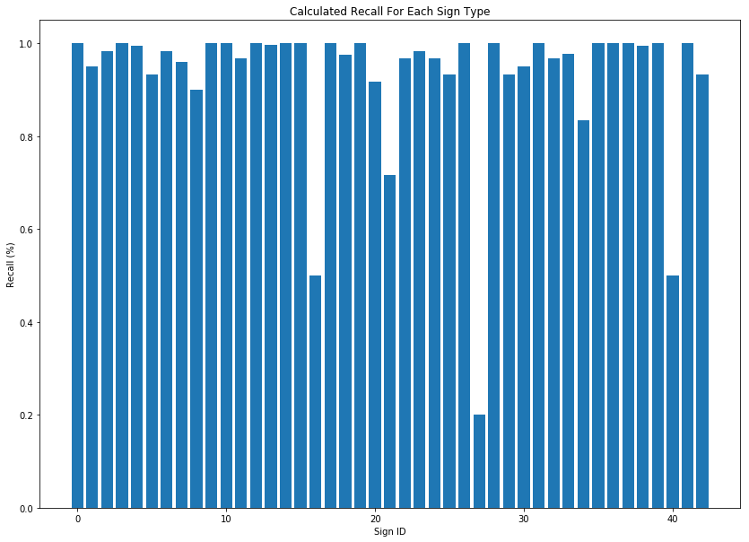

As can be seen the model has fairly good precision and recall (with more problems/variations with recall). There are some notable exceptions to this strong performance however. Sign type 41, end of no passing, has much weaker precision than the rest of the sign types. This means that this sign type is having the most false positives where the model is incorrectly classifying other signs as an end of no passing sign. Overall the precision of the model is pretty high across all of the sign types. The recall of the model has more sign types that performed poorly than the precision. Specifically sign type 16, vehicles over 3.5 metric tons prohibited; sign type 27, pedestrians and sign type 40, roundabout mandatory, had around or less than 50% recall. This means that the model is having a harder time identifying these sign types correctly and is misclassifying them as other types (for example causing the lower precision of the end of no passing sign as was previously discussed). If the model were to be improved I believe working on the models recall of the low percentage would have the greatest improvement on the system. One example would be to add more examples of low recall sign types to the training set (looking at the sign example distribution above shows that all of the low recall sign types were on the lower end of sign examples).

### Test a Model on New Images

#### 1. Choose five German traffic signs found on the web and provide them in the report. For each image, discuss what quality or qualities might be difficult to classify.

Here are five German traffic signs that I found on the web (shown is the original image and the image resized to be 32x32 pixels):

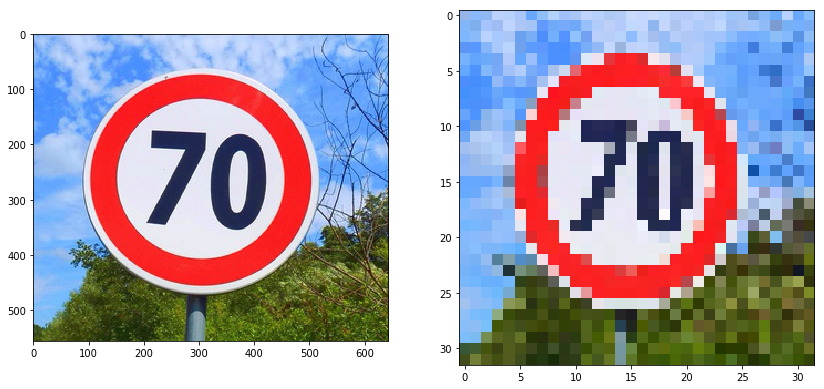  
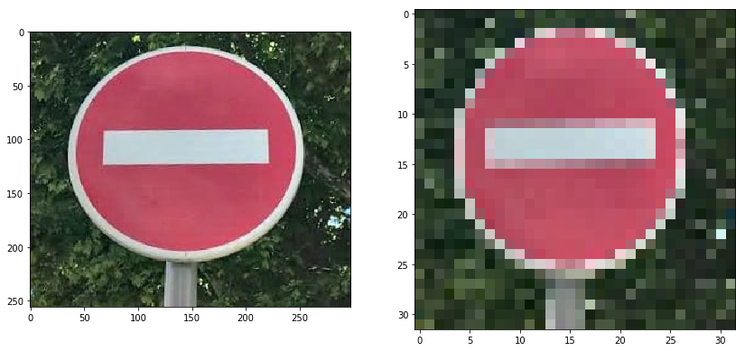 
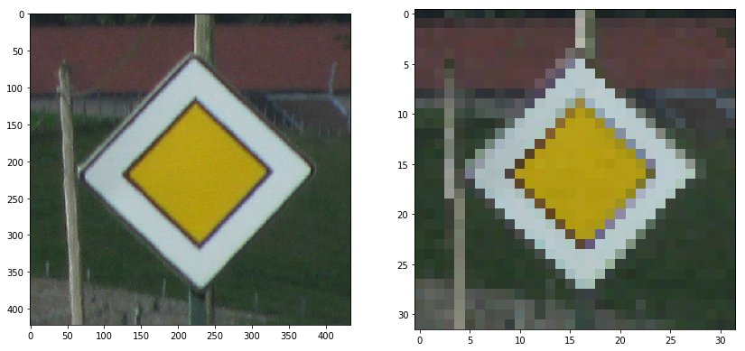 
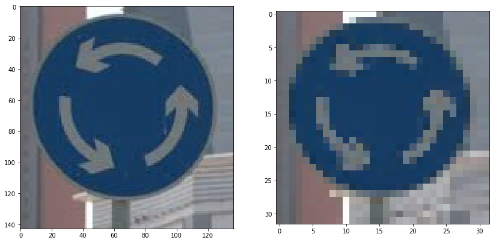 
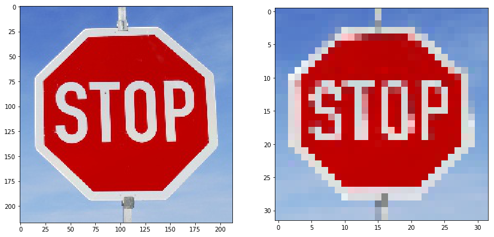

Of the signs found, the roundabout mandatory may be the most difficult to classify due to the pixelation of the arrows, though I don't anticipate that any of the signs would be terribly difficult to classify. As this was my first experience with machine learning I was mostly curious on whether or not the model would work on images that were not included as part of the training set. All of the images are rather clear and well lit, again showing that it is not assumed that they will be difficult to classify.

#### 2. Discuss the model's predictions on these new traffic signs and compare the results to predicting on the test set. At a minimum, discuss what the predictions were, the accuracy on these new predictions, and compare the accuracy to the accuracy on the test set (OPTIONAL: Discuss the results in more detail as described in the "Stand Out Suggestions" part of the rubric).

Here are the results of the prediction:

| Image			        |     Prediction	        					| 
|:---------------------:|:---------------------------------------------:| 
| Speed Limit (70km/h) 	| Speed Limit (30km/h)							| 
| No Entry     			| No Entry 										|
| Priority Road			| Priority Road									|
| Roundabout Mandatory	| Roundabout Mandatory	    	 				|
| Stop Sign 			| Stop Sign           							|

The model was able to correctly guess 4 of the 5 traffic signs, which gives an accuracy of 80%. This is lower than the accuracy of the validation set but due to the low sample size this is still a solid accuracy. The one sign that was misclassified was the 70 km/hr speed limit as a 30 km/hr speed limit sign. This leads me to believe that the model has the possibility of errors between the multiple speed limit signs due to their similarity compared to all of the other sign types.

#### 3. Describe how certain the model is when predicting on each of the five new images by looking at the softmax probabilities for each prediction. Provide the top 5 softmax probabilities for each image along with the sign type of each probability. (OPTIONAL: as described in the "Stand Out Suggestions" part of the rubric, visualizations can also be provided such as bar charts)

The top five softmax probabilities for each of the online images are presented in the tables below.

Sign 1: Speed Limit 70 km/h

| Probability         	|     Prediction	        					| 
|:---------------------:|:---------------------------------------------:| 
| .841        			| Speed Limit (30km/h)  						| 
| .159     				| Speed Limit (70km/h) 							|
| 7E-5					| Speed Limit (20km/h)							|
| 1E-8	      			| Keep Left 					 				|
| 3E-9				    | Speed Limit (100km/h)   						|

Sign 2: No Entry

| Probability         	|     Prediction	        					| 
|:---------------------:|:---------------------------------------------:| 
| 1.0        			| No Entry                						| 
| 0.0     				| Speed Limit (20km/h) 							|
| 0.0					| Speed Limit (30km/h)							|
| 0.0	      			| Speed Limit (50km/h) 			 				|
| 0.0				    | Speed Limit (60km/h)   						|
     
Sign 3: Priority Road
     
| Probability         	|     Prediction	        					| 
|:---------------------:|:---------------------------------------------:| 
| 1.0        			| Priority Road            						| 
| 0.0     				| Speed Limit (20km/h) 							|
| 0.0					| Speed Limit (30km/h)							|
| 0.0	      			| Speed Limit (50km/h) 			 				|
| 0.0				    | Speed Limit (60km/h)   						|

Sign 4: Roundabout Mandatory
     
| Probability         	|     Prediction	        					| 
|:---------------------:|:---------------------------------------------:| 
| 0.999999     			| Roundabout Mandatory    						| 
| 0.00012  				| Keep right         							|
| 5.19E-9				| Keep left         							|
| 2.84E-10	   			| Speed Limit (30km/h) 			 				|
| 2.62E-12			    | Priority Road   					        	|
      
Sign 5: Stop Sign

| Probability         	|     Prediction	        					| 
|:---------------------:|:---------------------------------------------:| 
| 1.0        			| Stop Sign             						| 
| 0.0     				| Speed Limit (20km/h) 							|
| 0.0					| Speed Limit (30km/h)							|
| 0.0	      			| Speed Limit (50km/h) 			 				|
| 0.0				    | Speed Limit (60km/h)   						|

The one misclassified sign of the 5 had the correct classification as the second prediction. The other large take away from the softmax probabilities is that in general the model is VERY certain of it's predictions. This is likely the result of overfitting though the high certainties for these signs are all correct predictions.